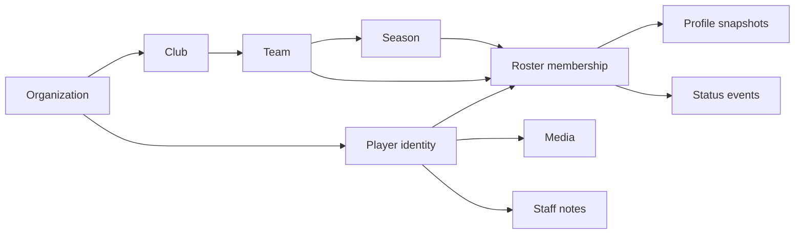

# Squad Scale Architecture

Squad is the durable player-roster module. The visible UI can stay simple: list first, player profile in a modal, add-player through a compact overlay. Under it, the data model must support millions of players across organizations, clubs, teams, and seasons without turning the browser into the database.

## Current Status

- Workspace id remains `player-profiles` so existing routes, permissions, storage, and app-state backups keep working.
- Product language should use `Squad`.
- Legacy storage key remains `football-player-profiles-v1` during rollout.
- The first database foundation is `supabase/migrations/20260507185637_squad_module_multitenant.sql`.
- The first module boundary is `src/modules/squad`, with a read-only adapter around the legacy state.

## Tenant Model

The important split is `squad_players` versus `squad_roster_memberships`:

- `squad_players` is the organization-owned identity record: name, sort name, birth data later, external ids, media, and stable profile identity.
- `squad_roster_memberships` is contextual: team, season, shirt number, role, role group, squad status, and availability.
- A player can be in multiple teams or seasons without duplicating identity.

## Scale Rules

- Never fetch every player for an organization into the client once the database adapter is enabled.
- List screens must use server-side filtering, cursor pagination, and indexed ordering.
- Search should hit indexed fields first: organization, status, `sort_name`, trigram `display_name`, team, season, role group, and status.
- Imports should land in `squad_import_batches`, validate rows, then apply in controlled batches.
- External systems should map through `squad_player_external_ids` instead of overloading names or shirt numbers.
- Role, IDP, medical, and performance detail should evolve as separate records/snapshots instead of making the roster row a giant JSON blob.
- Media belongs in storage; the database stores bucket/path metadata only.

## Security Rules

- All tables live behind RLS.
- Browser clients only get direct `select` grants for now; writes stay server-side until the database adapter is intentionally enabled.
- Supabase Data API exposure must be checked per project; newer projects may not expose new tables automatically.
- Authorization uses `app_metadata.role`, never user-editable metadata.
- Guest/player roles are excluded from staff access.
- Medical/private note visibility is filtered by policy and should remain separated from broad coach-safe availability summaries.
- Destructive changes should create `squad_audit_events`.

## Rollout Plan

1. Keep the current UI backed by `football-player-profiles-v1`.
2. Use `src/modules/squad` as the normalization and read boundary for tests and future API work.
3. Backfill organizations, clubs, teams, seasons, players, and roster memberships from the legacy payload.
4. Add a server API for paged list/search and player-profile reads.
5. Dual-read legacy and database data for one release window.
6. Dual-write add/edit/import actions with audit events.
7. Flip reads to database mode behind a feature flag.
8. Remove legacy writes only after backup and rollback drills pass.

## Product Direction

Keep the first screen calm and operational:

- Squad List at the top.
- Search, group filter, and add-player button in the same command bar.
- Player profile opens as a modal from row click.
- Heavy analytics such as depth charts, role DNA, and dashboards should stay hidden until they solve a real daily workflow.

The north star is boring in the best way: fast list, reliable profile, clean permissions, no accidental cross-organization leakage.
