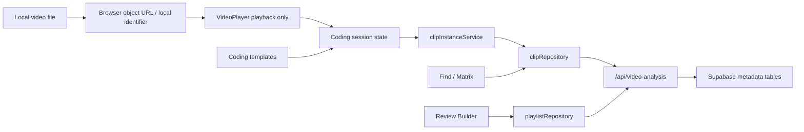

# Football Science Video Analysis - Coding Workstation v2

> Historical baseline: Workstation V2 is implemented and now extended by `ELITE_PLATFORM_ARCHITECTURE.md`. Items marked out of scope below were V2 boundaries, not current FS Player boundaries.

Status: implementation owner draft  
Principle: Video local. Knowledge central.

## 1. Product Requirements Document

### Mission
Build a principle-based football coding workstation where a coach can load a local match video, code clips at speed, connect each clip to Football Science language, find patterns, and build reviews without uploading video files.

### Target User
Analysts and coaches working in match review, player development, unit meetings, and team learning.

### Product Outcome
A coach should be able to create useful coded clips faster than a form-based workflow:

- Load a local video reference.
- Code with buttons and hotkeys.
- Use instant clips with pre/post-roll or manual I/O clips.
- Tag clips with phase, sub-phase, team principle, mini-game principle, outcome, player, unit, pitch zone, pressure, decision, and execution.
- See clip duration blocks on a timeline.
- Find clips through matrix-style combinations.
- Send results into review sections.
- Return to the exact millisecond timestamp.

### In Scope
- Coding template builder with buttons, hotkeys, and activation links.
- Manual and instant coding modes.
- Timeline lanes, playhead, zoom, clip blocks, and trim controls.
- Keyboard-first coding session.
- Find/matrix filters and saved search metadata.
- Review builder with Team Meeting, Unit Meeting, and Player Review sections.
- Database/API metadata expansion.

### Out of Scope
- Cloud video upload.
- Multi-angle playback.
- AI tagging.
- Automatic event detection.
- Telestration/drawing.
- Clip rendering/export engine.
- Broadcast coding.

## 2. User Flows

### Flow A: Fast Instant Coding
1. Coach loads a local video.
2. Coach sets mode to Instant.
3. Coach presses a phase/principle/outcome button or its hotkey.
4. System creates a clip around current playhead using pre/post-roll.
5. Activation links auto-select relevant mini-game principles.
6. Coach optionally assigns player/unit/descriptors.
7. Clip saves as metadata only.

### Flow B: Manual I/O Coding
1. Coach presses Space to play.
2. Coach presses I at clip start.
3. Coach uses phase/principle buttons and descriptors while play continues.
4. Coach presses O at clip end.
5. Coach presses Enter to save.
6. Draft resets to next start.

### Flow C: Find to Review
1. Coach opens Find/Matrix.
2. Coach chooses Phase x Outcome or Principle x Player.
3. Results update immediately.
4. Coach saves the search or sends matching clips to a review section.
5. Coach reorders review clips and writes meeting notes.

## 3. UX Wireframes

```text
+-----------------------------------------------------------------------+
| Local Video | Match title | Mode: Manual/Instant | Load | Play        |
|                                                                       |
|                       VIDEO PLAYER                                    |
+-----------------------------------------------------------------------+
| Timeline controls: zoom - [====] + | lanes: phase/player/unit/outcome |
| Playhead | Clip blocks with width=start/end duration                  |
+-----------------------------------------------------------------------+
| Coding Template Builder              | Find / Matrix / Results        |
| [1 Build Up] [2 High Press] ...      | Phase x Outcome                |
| [Team Principles] [MG Principles]    | Principle x Player             |
| Descriptors: Player Unit Zone...     | Saved searches                 |
| Draft Inspector + Notes              | Clip list -> Review            |
+-----------------------------------------------------------------------+
| Review Builder: Team Meeting | Unit Meeting | Player Review           |
+-----------------------------------------------------------------------+
```

## 4. Information Architecture

- Video Analysis Workspace
  - Local Video Player
  - Timeline
    - Lanes
    - Clip Blocks
    - Playhead
    - Zoom
  - Coding Template Builder
    - Code Buttons
    - Activation Links
    - Hotkeys
    - Mode Settings
  - Descriptor Panel
    - Player
    - Unit
    - Pitch Zone
    - Pressure
    - Decision
    - Execution
  - Clip Intelligence
    - Filters
    - Matrix Views
    - Saved Searches
  - Review Builder
    - Team Meeting
    - Unit Meeting
    - Player Review
    - Meeting Notes

## 5. System Architecture



### Boundaries
- VideoPlayer only handles local playback.
- Components do not call Supabase or `/api/video-analysis` directly.
- Services own workflow/business logic.
- Repositories own API access.
- API owns validation, tenant scope, forbidden video payload defense, and Supabase REST calls.
- Supabase stores metadata and coaching intelligence only.

## 6. Database Schema

Existing tables remain:
- `video_matches`
- `video_videos`
- `video_sources`
- `video_clip_instances`
- `video_clip_players`
- `video_clip_tags`
- `video_clip_notes`
- `video_coding_schemas`
- `video_playlists`
- `video_playlist_items`

New v2 metadata tables:
- `video_coding_templates`
- `video_coding_buttons`
- `video_coding_button_links`
- `video_clip_labels`
- `video_clip_descriptors`
- `video_timeline_lanes`
- `video_saved_clip_searches`
- `video_playlist_sections`
- `video_review_sessions`
- `video_clip_revisions`

Security rules:
- No raw video, file paths, blobs, base64, or storage bucket references.
- All times use milliseconds.
- Public tables have RLS enabled.
- `anon` and `authenticated` get no direct table access for this module.
- `service_role` access is explicit and used only from the guarded API route.

## 7. State Architecture

Primary state groups:
- `playback`: playhead, duration, zoom, current local reference.
- `session`: manual/instant mode, in/out markers, pre/post-roll, active button.
- `draft`: clip metadata and descriptors.
- `templates`: active template, buttons, activation links.
- `timeline`: lane grouping, selected clip, trim target.
- `filters`: search, matrix mode, phase/outcome/player/principle/unit.
- `review`: active session, active section, section items and notes.
- `persistence`: status, message, error.

Rules:
- Derived UI, matrix counts, and lane groups are selectors.
- Draft state is local until save.
- Review list can be local in browser before server persistence is available, but API supports durable review sessions.

## 8. Module Dependency Map

```text
components/* -> renderHelpers + constants only
index.js -> components + services + repositories + store
services/* -> domain + constants
repositories/* -> video-analysis.routes.js
api/video-analysis.js -> platform security + video-analysis-database
api/_lib/video-analysis-database.js -> Supabase REST through service role
```

Forbidden:
- Component -> Supabase.
- VideoPlayer -> players/principles/playlists.
- Web UI -> local file path exposure.
- Video Analysis -> medical/scouting/chat internal modules.

## 9. Security Review

Main risks:
- Accidental upload or logging of local video paths.
- Direct Data API access bypassing tenant checks.
- Player review data leaking across team/tenant boundaries.
- Overly broad review export later.

Controls:
- Payload scanner rejects path-like strings and forbidden video keys.
- API actor scope adds organization/team to every write/read.
- New tables are RLS-enabled and direct client grants are revoked.
- Review notes and descriptors are treated as player data.
- Future export must require explicit `video-analysis:export`.

## 10. Scalability Review

Expected data:
- Many clips per match.
- Many descriptors per clip.
- Repeated search by phase/outcome/principle/player/unit.

Controls:
- Composite indexes on match/video timeline ordering.
- Indexes on descriptor type/value.
- Saved search definitions stored as JSON, not duplicated result rows.
- Review sections separate ordering from clip metadata.
- Revisions append audit history without rewriting clip history.

## 11. Risk Assessment

High:
- Timeline editing can create invalid clip ranges. Mitigation: service/API clamps and validates `end_ms > start_ms`.
- Broad migration touches live metadata. Mitigation: additive schema only, no destructive table changes.

Medium:
- UI complexity can exceed module limits. Mitigation: split components by responsibility.
- Hotkeys can interfere with typing. Mitigation: ignore shortcuts inside inputs/textareas/selects.

Low:
- Existing MVP users may need orientation. Mitigation: preserve load/save/list/jump workflow while making faster paths primary.

## 12. Implementation Roadmap

### Phase 1: Recovery MVP
- Add Workstation v2 spec.
- Add additive metadata tables and API normalization.
- Add template buttons, activation links, descriptors, hotkeys, timeline lanes, matrix filters, and review sections.
- Add contract tests for schema, API payloads, module boundaries, and keyboard/workstation UX.

### Phase 2: Durable Reviews
- Persist review sessions and sections fully.
- Add drag/drop order persistence.
- Add saved search CRUD.
- Add player review auto-filter from squad profile.

### Phase 3: Professional Analyst Features
- Bulk tagging.
- Advanced timeline edit history.
- Meeting mode.
- Export metadata packages.

### Phase 4: Advanced Video Intelligence
- Multi-angle.
- Telestration.
- AI-assisted tagging.
- Clip rendering.
